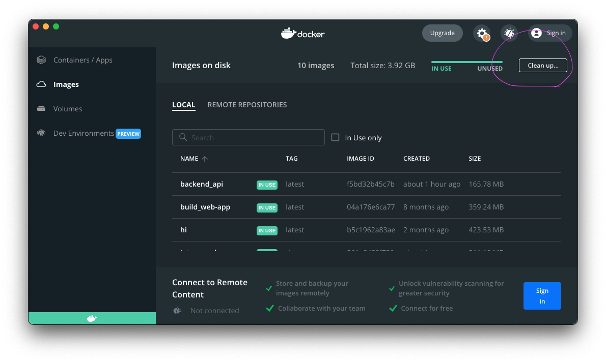
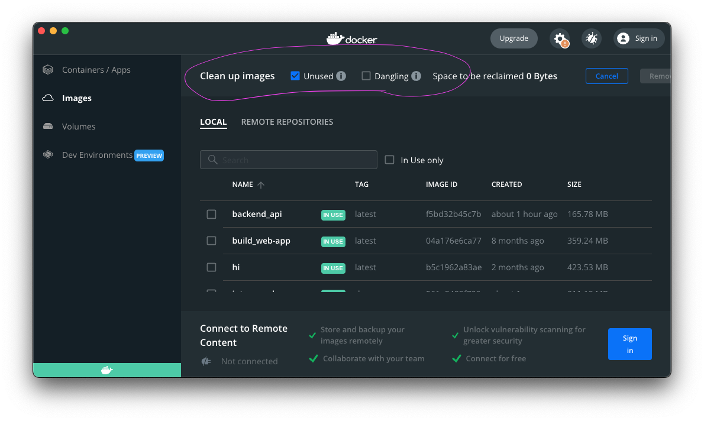

# School Interview: Backend Application

This is the backend application for school interview system.

For more infomatino on API, see [API Design Doc | 修学面談システム](https://www.notion.so/API-Design-Doc-107879aba7c68062bfa4e4ea7a69815c)

## Set Up

### Launch Server

This project requires Docker.

If you haven't installed Docker Desktop, you can [download and install it here.](https://docs.docker.com/desktop/install/mac-install/)

After you installed Docker Desktop, you can launch the backend app with these commands below. (This is all you need to launch it 😎)

```
cd backend
docker compose --profile backend up --build

docker compose --profile backend up
// ↑ After you build the docker image, you don't need to specify --build option anymore
```

The app is available on `http://localhost:8000`.
(When `--build` option is specified, Docker automatically build the docker image before the container launches.)

### Prepare `.env.local` in `backend` directory.

## Swagger

You can view Swagger by accessing `/docs` endopoint.

```
http://localhost:8000/docs
```

# For backend developer

🔔 If you haven't installed `Poetry` (package manager for Python, like `npm` for Nodejs), you need to install it first.

You can read [the official document](https://python-poetry.org/docs/#installing-with-pipx) to install it.

(I used `With pipx` installation method to install Poetry. Then, you need HomeBrew. If you have any trouble with installing it, feel free to ask me, DanFujisaki. It's pretty complicated.😅)

```
poetry shell
poetry install
```

## Launch server

### 1. Activate virtual environment

(If you have already activated it, you don't have to execute this command. You can skip this step.)

```
poetry shell
```

### 2. Launch FastAPI server

I wrote shell script to launch it in `launch-server.sh`.
You can execute it to launch the app.

```

./backend/launch-server.sh

```

## How to activate virtual environment

[Using yor virtual environment shell | Poetry Official Document](https://python-poetry.org/docs/basic-usage/#using-your-virtual-environment)

Type the command below in Terminal at the `backend` directory.

If this is your first time to execute the command, poetry automatically create virtual environment for you and activate the virtual environment.

```
poetry shell
```

If you just wanna execute a command in the environment, you can use `poetry run` command.

```
poertry run <command here...>
```

## Tips: delete unused docker images

When you develop app with docker, you build lots of images.

That's better to delete unsed images since they consume storage space when they accumulate.

1. Click "Clean up" in Images page.
   

2. Click "unused images" and then click "Remove"
   

## Tips: `import` path should start with `src`

This project uses Alembic as migration tool.

There is a file called `env.py` in `migrations` directory.

The file runs when migrating and it try to import `BaseModel` from `models` directory.

It means that Python interpreter read the `BaseModel` modules.

If you don't write import path that start with `src` such as `models.BaseModel` not `src.models.BaseModel`,

Python interpreter can't find it because it can't see `models`. but it can see `src.models`
