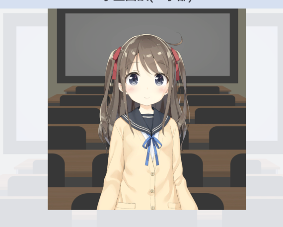

# Unity

本プロジェクトでは、面談相手となるアバターを**Unity**を使って表示しています。



## Unityディレクトリについて

アバターの挙動はこちらのUnityディレクトリ内で管理しています。

## セットアップ

1. [Unity Hub](https://unity.com/ja/download)をダウンロードする。
2. Unity Hubを開いて、`プロジェクト < 追加 < ディスクから加える`から本ディレクトリ内の`flutter_live2d`を選択する。

## アバターの実装

1. Unity Hubで`flutter_live2d`プロジェクトを開いて、編集する。
2. 変更をクライアントに適用したい場合、メニューバーの`Flutter < Export Web GL`を選択する。
    ```
   -- WebGL Build: SUCCESSFUL --
    ```
   Consoleに上の表示が出ていれば成功です。

3. `File < Save`で変更を保存します。
4. `unity`ディレクトリと`web < UnityLibrary`ディレクトリの差分のcommitを忘れず行ってください。